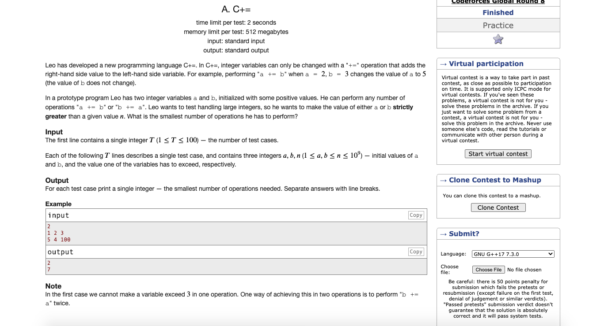

# Codeforces-1368A-C-Plus-Equals
### Problem

### Program Simulation
<pre>
  Sample Input: 1 2 3

  if 1 < 2
  c = a // 1
  c = 1
  a = b // 2
  a =  2
  b = c // 1
  b = 1

  cnt = 0

  first loop 

  if cnt is even // not omitted
  b += a // 1 + 2 = 3
  b = 3
  c = b // 3
  c = 3
  cnt++
  cnt = 1
  if(3 > 3) break // omitted

  loop again

  if cnt is even // omitted
  a += b // 2 + 3 = 5
  a = 5
  c = a // 5
  c = 5
  cnt++ 
  cnt = 2
  if(5 > 3) break // not omitted

  end loop

  print cnt

  Final Output:
  2
  
  Sample Input: 5 4 100

  if 5 < 4 condition // omitted

  cnt = 0

  *first loop

  if cnt is even // not omitted
  b += a // 4 + 5 = 9
  b = 9
  c = 9
  cnt++
  cnt = 1
  if 9 > 100 // omitted

  *second loop
  if cnt is even // omitted
  a += b // 5 + 9 = 14
  a = 14
  c = 14
  cnt++
  cnt = 2
  if 14 > 100 // omitted

  *third loop
  if cnt is even // not omitted
  b += a // 9 + 14 = 23
  b = 23
  c = 23 
  cnt++
  cnt = 3
  if 23 > 100 // omitted

  *fourth loop
  if cnt is even //omitted
  a += b // 9 + 23 = 32
  a = 32
  c = 32
  cnt++
  cnt = 4
  if 32 > 100 // omitted

  *fifth loop
  if cnt is even // not omitted
  b += a // 23 + 32 = 55
  b = 55
  c = 55
  cnt++
  cnt = 5
  if 55 > 100 // omitted

  *fifth loop
  if cnt is even // omitted
  a += b // 32 + 55 = 87
  a = 87
  c = 87
  cnt++
  cnt = 6
  if 87 > 100 // omitted

  *sixth loop
  if cnt is even // not omitted
  b += a // 55 + 87 = 142
  b = 142
  c = 142
  cnt++
  cnt = 7
  if 142 > 100 // not omitted

  *end loop

  print cnt

  Final Output:
  7
</pre>
